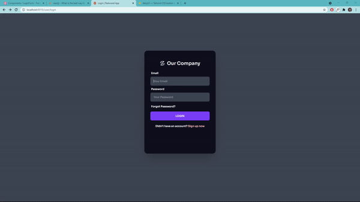
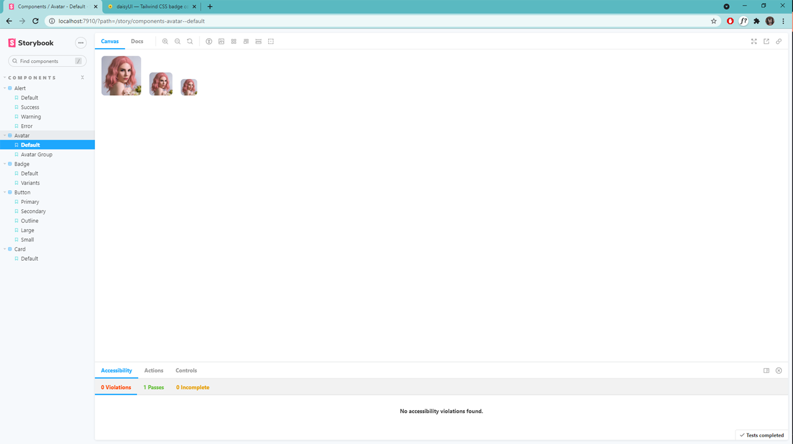

<h1 align="center"><strong>App for a FullStack GraphQL App with Redwoodjs</strong></h1>

<br />


## 👋 Hello, Everyone

Ini adalah JAMSTACK App menggunakan Redwood.js

## 👩🏾‍💻 Cara Menginstall file ini

```bash
$ git clone https://github.com/ioofy/App.git
$ yarn install

```
 * Install semua file menggunakan yarn pkg, kemudian masuk kebagian production dengan bash

```bash

$ yarn rw dev

```

 * Jika ingin masuk ke bagian storybook

```bash

$ yarn rw storybook

```

## 📷 Preview Signin



## 📘 Preview StoryBook



